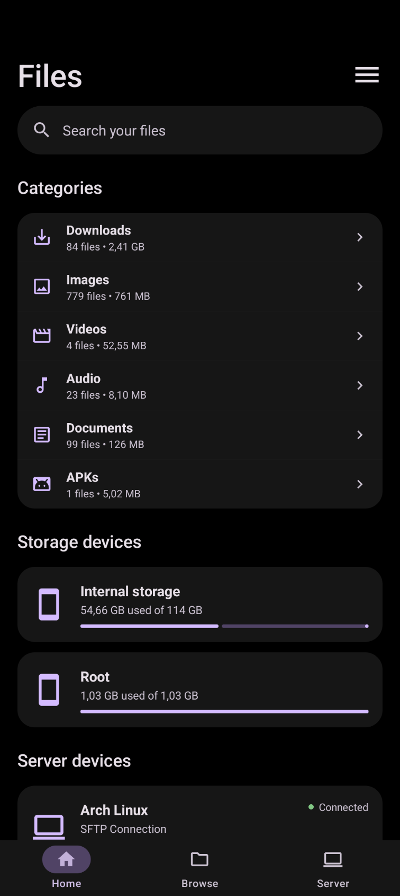
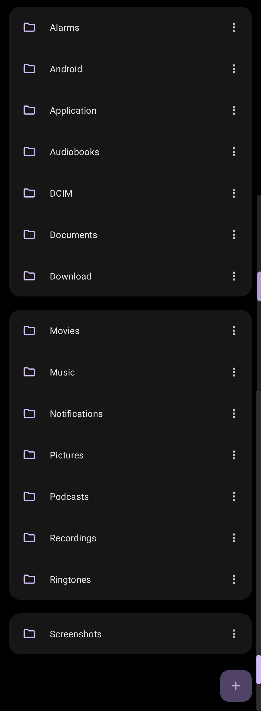
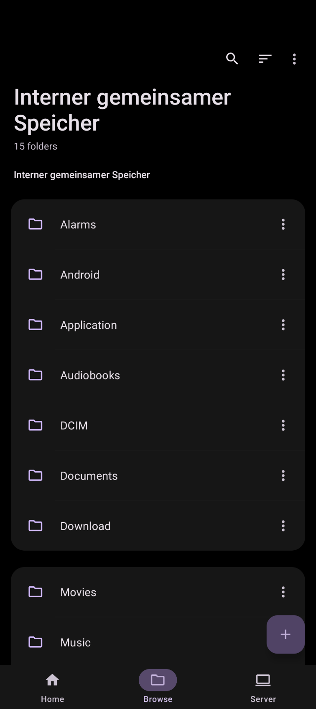
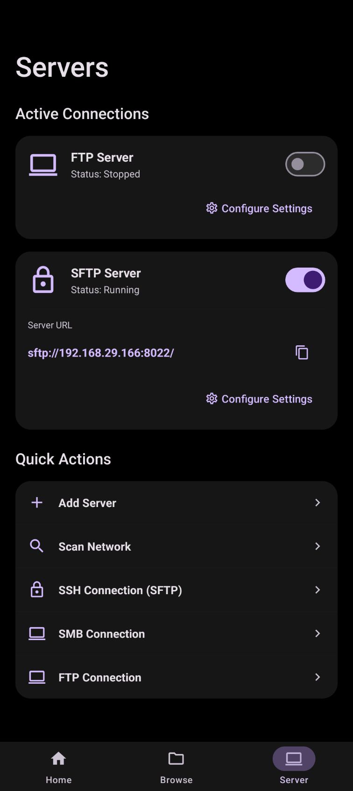
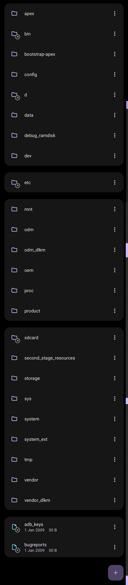
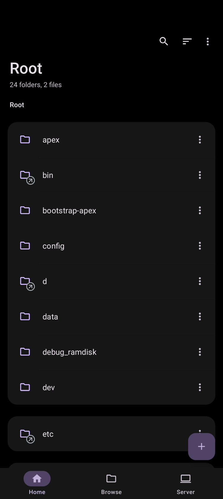
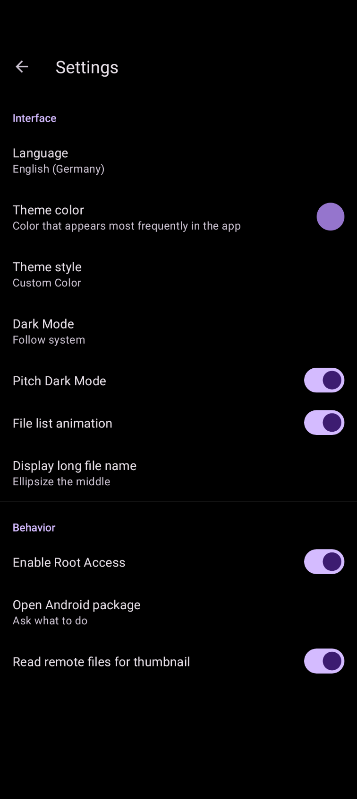

# M-Explorer

M-Explorer is a modern, high-performance, and feature-rich file manager for Android. Built with a focus on speed, privacy, and seamless system integration, M-Explorer provides robust tools for managing your local internal storage, root filesystems (via Shizuku), and remote network servers.

## Features

- **Modern Interface**: Material Design 3 architecture with customizable themes, including Dark Mode and Pitch Dark Mode for OLED displays.
- **High-Performance Navigation**: Instant category loading leveraging Android's MediaStore, combined with memory-efficient pagination for rendering massive directories seamlessly.
- **Root Access via Shizuku**: Securely browse and modify system files without compromising device security. Shizuku operates entirely on-demand via binder IPC.
- **Comprehensive Network Support**: Connect to external FTP, SFTP, SMB, and WebDAV servers.
- **Built-in SFTP Server**: Securely host an SFTP server directly from your Android device for wireless file transfers.
- **Advanced File Operations**: Supports batch processing, asynchronous thumbnail generation, and archive creation/extraction (ZIP, TAR, etc.).
- **Privacy First**: Zero telemetry, zero analytics, and completely offline-first.

## Screenshots

<div style="display: flex; flex-wrap: wrap; gap: 10px;">
  
  
  
  
  
  
  
</div>

## Installation

You can install M-Explorer by downloading the latest APK from the [Releases](../../releases) page, or by building it from source.

## Permissions Explanation

M-Explorer requests only the permissions necessary for its core functionalities:
- **Storage Access**: Required to manage internal files and media. (For Android 11+, "All Files Access" is requested to provide full filesystem capabilities).
- **Network Access**: Required exclusively for remote FTP/SFTP/SMB connections and hosting the internal SFTP server.
- **Foreground Service**: Used for keeping network servers alive in the background and for tracking long-running file transfers.

## Shizuku Integration & Root Access

M-Explorer natively supports [Shizuku](https://shizuku.rikka.app/) for modifying protected system files. 

Unlike traditional root file managers that execute arbitrary and potentially dangerous `su -c` shell commands, M-Explorer delegates root operations safely through a Java IPC binder. 
- **On-Demand**: Root access is heavily guarded by the "Enable Root Access" toggle in Settings. 
- **Safe Execution**: Shizuku is strictly verified via `pingBinder()` before any privileged operation executes, preventing silent failures or phantom processes.

## SFTP Server & Client

M-Explorer acts as both a secure SFTP client and server:
- **Client**: Connect to any remote server. Your passwords and private SSH keys (Ed25519/ECDSA) are encrypted at rest using Android's Keystore (`EncryptedSharedPreferences`). M-Explorer also enforces a Trust-On-First-Use (TOFU) policy for verifying remote host fingerprints.
- **Server**: Start an SFTP server on your device to wirelessly push or pull files from your PC.

## Security Notes

M-Explorer is designed to isolate your credentials from other apps. Remote server passwords and keys are never stored in plaintext XML. If you intend to use the SFTP server on public Wi-Fi, it is highly recommended to use SSH Key authentication rather than passwords.

## Known Limitations

- SMB and WebDAV implementations are currently experimental and may not support all legacy network topologies.
- Shizuku requires an active pairing state on unrooted devices (via Wireless Debugging or ADB).

## Build Instructions

1. Clone the repository:
   ```bash
   git clone https://github.com/yourusername/M-Explorer.git
   ```
2. Open the project in Android Studio.
3. Build the project using Gradle:
   ```bash
   ./gradlew assembleDebug
   ```

## License

This project is licensed under the MIT License. See the [LICENSE](LICENSE) file for more details.
