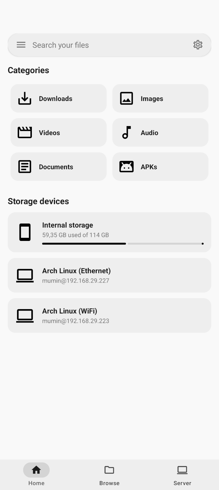
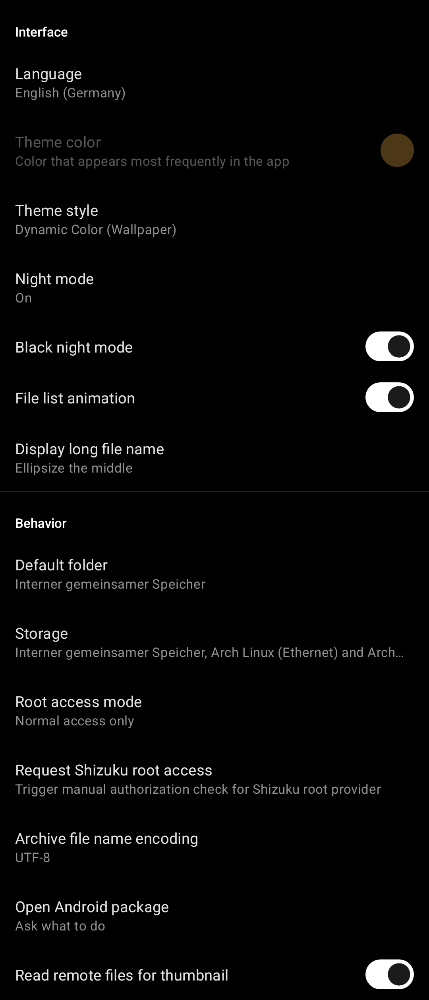
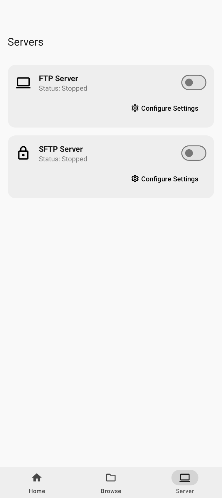
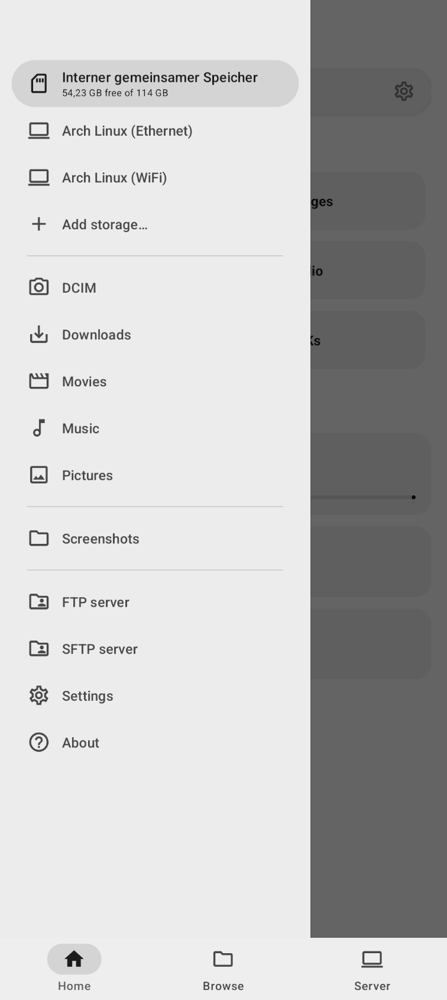
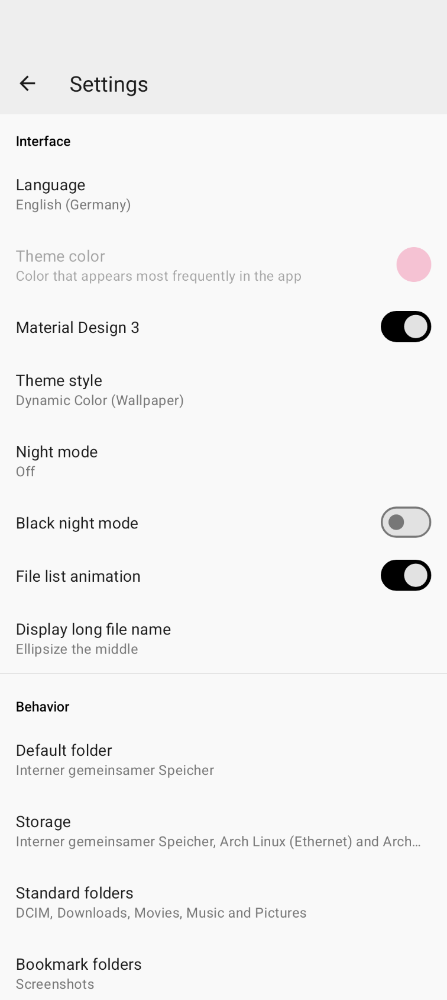
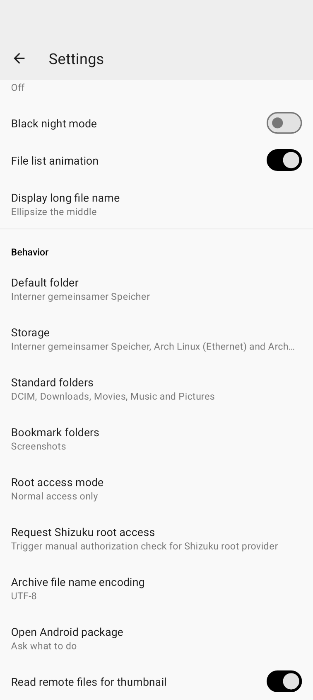

# M-Explorer

Ein Open-Source-Dateimanager im Material Design für Android 5.0+, entwickelt mit erstklassiger Benutzererfahrung (UX), einer Struktur im Stil von Google Files und integrierten Netzwerkfreigabe-Funktionen.

## Vorschau

  
  
  

  
  
  

## Hauptfunktionen

- **Google Files UI-Layout**: 
  - **Startseite**: Dashboard zur Anzeige von Speicherkarten, Verbindungsstatus und interaktiven Dateikategorien (Downloads, Bilder, Videos, Audio, Dokumente, Apps).
  - **Durchsuchen**: Intuitive Erkundung Ihres internen Speichers.
  - **Server**: Schnelle Konfiguration und Steuerung von Netzwerk-Freigabeprotokollen.
- **Integrierter SFTP-Server**:
  - Sicherer Zugriff und Dateitransfer zwischen Ihrem Android-Gerät und jedem Computer oder externen Client über das native SFTP-Protokoll.
  - Einfache Konfiguration eigener Anmeldedaten (Benutzername und Passwort) direkt im Einstellungsmenü.
  - Integration einer Kachel in die Schnelleinstellungen (Quick Settings Tile), um den SFTP-Server mit einem Fingertipp direkt aus der Android-Statusleiste zu starten oder zu stoppen.
- **Datenmüll-Bereinigung (Junk Cleaner)**: Integriertes Dienstprogramm zum Scannen, Analysieren und Löschen nicht genutzter App-Ressourcen und temporärer Cache-Dateien mit nur einem Fingertipp.
- **NAS- & Netzwerkunterstützung**: Integrierte Steuerung zum Durchsuchen und Hosten von FTP- und SFTP-Konfigurationen sowie SMB- und WebDAV-Netzwerkfreigaben.
- **Moderne Navigation**: Vollständige Integration der vorausschauenden Zurück-Geste (Predictive Back Gesture) und standardmäßiger Material Design-Übergänge.
- **Linux-optimierte Engine**: Systemnahe Dateioperationen durch direkte Bindungen an Linux-Systemaufrufe (Syscalls) mit Unterstützung für symbolische Links, Dateiberechtigungen und SELinux-Kontexte.
- **Sicher & Robust**: Nutzt leistungsstarke, desugarisierte Java-NIO2-Datei-APIs in Kombination mit einer entkoppelten ViewModel-Architektur.

## Architektur & Designentscheidungen

### Entkoppelter Backend-Bereich
Durch den Verzicht auf herkömmliche Parsing-Methoden (wie standardmäßige `ls`-Auswertungen) und die Einschränkungen der alten `java.io.File`-Klassen nutzt M-Explorer native Unix-Dateisystem-Anbindungen. Dies garantiert maximale Leistung bei Dateiübertragungen, ein robustes Fehlermanagement und die korrekte Darstellung von Dateinamen mit ungültigen Zeichensätzen.

### Benutzererfahrung (UX)
M-Explorer legt großen Wert auf klare visuelle Strukturen, flüssige Animationen, dynamische Farbthemen (einschließlich eines echten schwarzen Nachtmodus) und eine nahtlose Gestennavigation.
