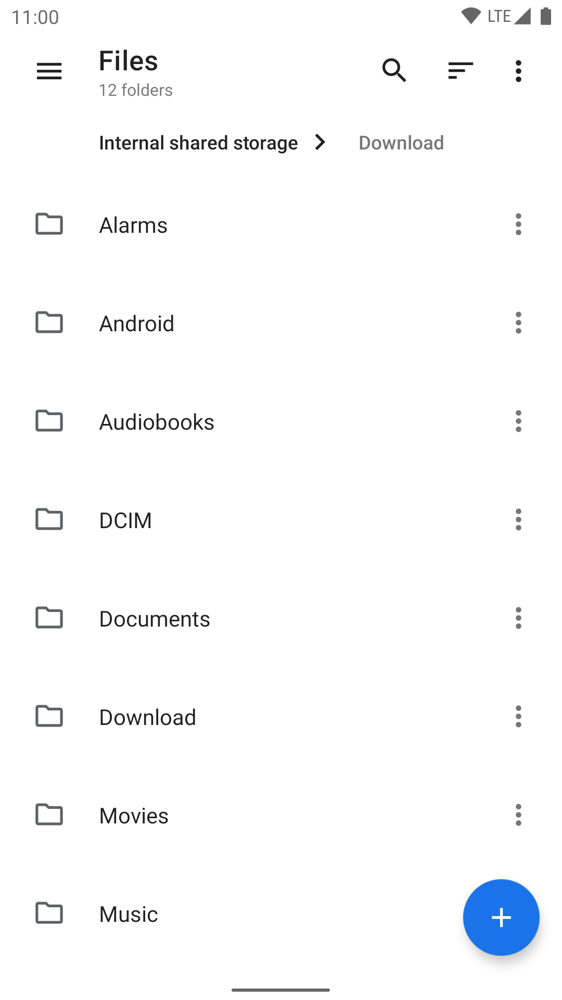

# M-Explorer

一个开源的 Material Design 文件管理器，适用于 Android 5.0+。应用融入了类似 Google Files 的高效主页布局、垃圾清理工具和多协议网络共享功能。

## 预览

  
  
  

## 核心特性

- **Google Files 风格布局**: 
  - **主页**：可视化存储状态卡片、网络共享服务器入口，以及快捷分类视图（下载、图片、视频、音频、文档、应用）。
  - **浏览**：直观探索本地内部存储。
  - **服务器**：一键配置、启动与停止 FTP、SFTP 共享服务。
- **缓存清理**: 内置一键扫描并清理临时缓存和冗余系统文件功能。
- **网络存储支持**: 内置对 FTP、SFTP、SMB 和 WebDAV 服务器的访问及本地托管。
- **现代化手势导航**: 原生支持 Android 预测性返回手势及 Material You 动效。
- **深层 Linux 整合**: 底层直接绑定 Linux 系统调用，支持符号链接、Linux 权限控制和 SELinux 上下文，彻底告别脆弱的 `ls` 输出解析器。
- **稳健可靠**: 采用 Java NIO2 文件 API 与 LiveData 响应式设计。

## 架构与技术选型

### 解耦后端
M-Explorer 抛弃了传统的 Java IO 文件操作，转而通过 C 语言 bindings 直接与 Linux 内核交互。这确保了在大文件处理、底层权限修改和非常规字符集编码文件操作中的卓越稳定性。

### 视觉与动效
遵循 Material You 规范，提供可定制的主题配色（包括纯黑模式）与平滑手势响应，致力于打造一流的用户体验。

## 开源协议

本项目采用 GNU General Public License v3.0 开源协议。详情请查阅 `LICENSE` 文件。
